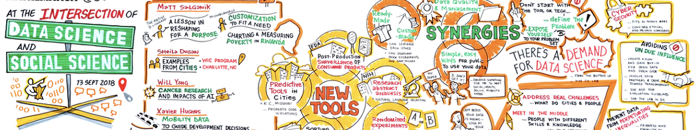

# TC2002B.651-Ciencia-de-datos

Repositorio de archivos del curso de **Ciencia de datos para la toma de decisiones** impartido en el Tec de Monterrey en el semestre de Otoño-Invierno del 2025. 

**Profesores: ** M.C. Jorge Juvenal Campos Ferreira y Jose Manuel Toral.

**Objetivo del curso: ** Diseñe, implemente y comunique soluciones de ciencia de datos de forma integral, combinando el uso de programación en R, análisis estadístico, IA generativa, procesamiento de texto, análisis geoespacial y manejo de datos a gran escala, de tal forma que le ayuden a la toma de decisiones estratégicas basadas en evidencia. 

## Temario

### Large Language Models
* 0.1 Fundamentos teóricos de LLMs
* 0.2 Utilización de herramientas de LLMs para generación de textos y código

### MÉTODOS NO SUPERVISADOS DE APRENDIZAJE DE MÁQUINA
* 1.1 INTRODUCCIÓN A MODELOS BASADOS EN DISTANCIA.
* 1.2 NEAREST NEIGHBOURS.
* 1.3 K-MEANS.
* 1.4 K-MEDOIDS.
* 1.5 HIERARCHICAL CLUSTERING.
* 1.6 Evaluar la calidad y utilidad de clusters en contextos reales
* 1.7 Traducir los resultados en segmentos, grupos o patrones accionables

### ANÁLISIS GEO-ESPACIAL
* 2.1 INTRODUCCIÓN A DATOS GEOESPACIALES.
* 2.1.1 Introducción al trabajo con datos espaciales (coordenadas, polígonos, shapefiles, etc.).
* 2.2 MÉTODOS DE MEDICIÓN DE DISTRIBUCIONES GEOGRÁFICAS.
* 2.3 IDENTIFICACIÓN DE PATRONES Y CLUSTERS EN ESPACIOS GEOGRÁFICOS.

### PROCESAMIENTO DE LENGUAJE NATURAL
* 3.1 INTRODUCCIÓN AL PROCESAMIENTO NATURAL DE TEXTO (NLP)
* 3.2 ESTADÍSTICAS BÁSICAS DE TEXTO
* 3.3 REGULAR EXPRESSIONS
* 3.4 PROCESAMIENTO DE HTML CON BEAUTIFUL SOUP (Web Scraping)
* 3.5 REDES Y TEXTO NO ESTRUCTURADO (grafos, enlaces).
* 3.6 DESCARGA DE TEXTO NO ESTRUCTURADO DE INTERNET
* 3.7 Descarga de datos desde APIs

### ARQUITECTURA DE DATOS
* 4.0 Diseñar bases de datos
* 4.1 BASES DE DATOS: RELACIONALES (SQL), NO RELACIONALES (MONGO, DYNAMO), CSV Y JSON.
* 4.2 INSTANCIAS, CÓMPUTO DISTRIBUIDO, PROCESAMIENTO EN PARALELO, CONTENEDORES Y MICROSERVICIOS.

### DESARROLLO DE UNA NARRATIVA DE COMUNICACIÓN
* 4.5.1 Presentación de hallazgos con datos para audiencias no técnicas
* 4.5.2 Integrar resultados de modelos, análisis espaciales y textuales en informes estratégicos
* 4.5.3 Argumentar decisiones en base en evidencia y métricas.

> Nota: Temas en minúsculas son adición del nuevo profesor. Notas en MAYÚSCULAS son parte del temario oficial del curso. 

## Evaluación 

Los criterios de evaluación son los siguientes: 

* (30%) Reto del socio formador
* (35%) Tareas
* (35%) Examenes

Se realizará un mínimo de dos examenes, y una serie de tareas relativas a los temas que se revisarán. Tanto Manuel como yo nos encargaremos de construir el examen. 

## Sobre el reto

> Durante este semestre, trabajaremos en colaboración con Global Fund for Women en un reto enfocado en el uso de ciencia de datos para potenciar su misión de financiar y fortalecer movimientos sociales alrededor del mundo. 

> El desafío consistirá en desarrollar un modelo que tome como insumo principal texto —por ejemplo, documentos, narrativas o descripciones de proyectos— y que pueda aportar valor a la organización en la identificación, clasificación o análisis de información relevante para sus objetivos estratégicos. Este modelo podrá ser supervisado o no supervisado, según la naturaleza del problema planteado y la estrategia de abordaje del equipo. 

> Para ello, contaremos con la Dra. María de los Ángeles Lasa, Gerente del Data Gender Hub, como socia formadora, quien nos guiará para asegurar que la solución propuesta esté alineada con las necesidades reales y el impacto social que busca la organización.

## Presentaciones 

Las presentaciones se encuentran en la carpeta `00_Presentaciones`, de donde se podrán descargar para su uso diario. En una etapa inicial, no todas las presentaciones estarán disponibles para su consumo; estas se estarán cargando a lo largo del curso. Asimísmo, además de estar disponibles en Github, se compartirán por correo electrónico y se subirán a la carpeta de **Canvas** del curso. 

* Al ser un curso con material en desarrollo, los archivos de presentación pueden ir cambiando a lo largo del semestre para complementar algún punto visto en clases posteriores. 

* [Presentación 1. Presentación del curso](00_Presentaciones/Clase01.pdf)

* [Presentación 2. Generación de código con LLMs](00_Presentaciones/Clase02.pdf)

* [Presentación 3. Introducción a R y RStudio](00_Presentaciones/Clase03.pdf)

## Lista de tareas por semana. 

Solo se deja tarea cuando se diga ello explícitamente. La lista de tareas se encontrará en la carpeta [03_Tareas y ejercicios](03_Tareas y ejercicios). Las tareas se enviarán al correo del profesor (juvenal.campos@tec.mx) en la fecha establecida. Las tareas se proporcionarán en formato pdf, y se entregarán en el formato especificado en esta. 

## Ejercicios prácticos

Los ejercicios prácticos se guardarán en la carpeta de [01_Ejercicios prácticos](01_Ejercicios prácticos), la cual tendrá una carpeta para cada sesión. Además de esta, se guardarán en una carpeta en la nube. 

En la carpeta vendrá 1) una carpeta con los archivos necesarios para llevar a cabo el ejercicio y 2) una carpeta con el ejercicio resuelto, para cada ejercicio. 

Los ejercicios se grabarán a solicitud de los estudiantes, si así lo demandasen y si el ejercicio lo permite. 

## Lista de lecturas, videos y cursos online recomendadas. 

En esta sección tendremos la lista de lecturas recomendadas del curso. Las lecturas no son obligatorias, pero es recomendable para tener la bibliografía a la mano. Igualmente, dada la naturaleza de la materia y de las herramientas (recientes, poca literatura, literatura que se queda obsoleta pronto), se incluye una lista de cursos recomendados para que, ahora o en un futuro cercano, puedan complementar la formación. 

**Clase 1. Presentación.**

*   [¿Cómo funcionan los LLMs?](https://www.youtube.com/watch?v=awGfhmsN7Lc)

**Clase 2. Generación de código con LLMS**

*   Curso de Claude Code (en inglés, gratis, con registro): https://anthropic.skilljar.com/claude-code-in-action

## Herramientas

A continuación, se enlistan algunas de las herramientas a utilizar durante el curso. Esta lista se ampliará a lo largo del semestre, de ser necesario. 

* **R: ** https://www.r-project.org

* **RStudio: ** https://posit.co/download/rstudio-desktop/ 

* **DuckDB:** https://duckdb.org/docs/installation/?version=stable&environment=cli&platform=macos&download_method=direct

Herramientas de IA: 

* **Claude Code: ** https://docs.anthropic.com/en/docs/claude-code/setup 

* **Gemini CLI: ** https://github.com/google-gemini/gemini-cli 

* **Codex CLI: ** https://github.com/openai/codex

## Horarios de oficina

A acordar con el profesor a través de correo. 

